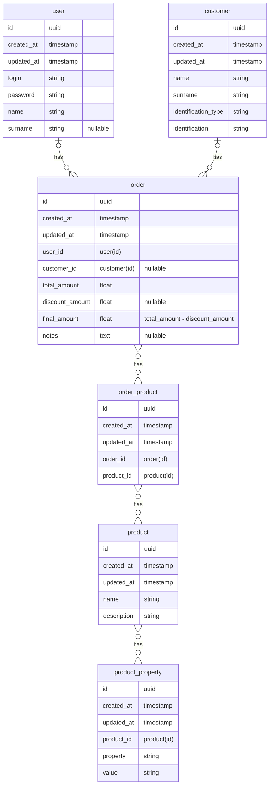

# Elixir Orders

## The Idea

```mermaid
erDiagram
    user {
        id uuid
        created_at timestamp
        updated_at timestamp
        login string
        password string
        name string
        surname string "nullable"
    }

    order {
        id uuid
        created_at timestamp
        updated_at timestamp
        user_id user(id)
        customer_id customer(id) "nullable"
        total_amount float
        discount_amount float "nullable"
        final_amount float "total_amount - discount_amount"
        notes text "nullable"
    }

    product {
        id uuid
        created_at timestamp
        updated_at timestamp
        name string
        description string
    }

    product_property {
        id uuid
        created_at timestamp
        updated_at timestamp
        product_id product(id)
        property string
        value string
    }

    order_product {
        id uuid
        created_at timestamp
        updated_at timestamp
        order_id order(id)
        product_id product(id)
    }

    customer {
        id uuid
        created_at timestamp
        updated_at timestamp
        name string
        surname string
        identification_type string
        identification string
    }

    user |o--o{ order: "has"
    customer |o--o{ order: "has"
    order }o--o{ order_product: "has"
    order_product }o--o{ product: "has"
    product }o--o{ product_property: "has"
```
