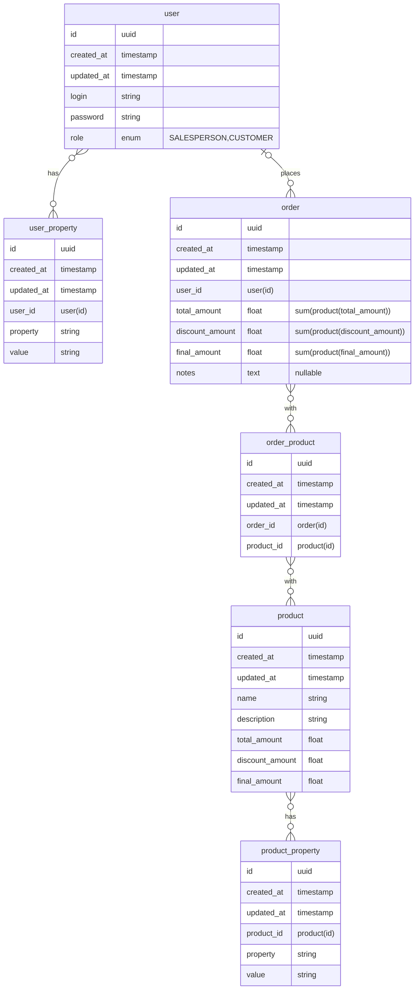

# Elixir Orders

## The Idea

```mermaid
erDiagram     
    user {
        id uuid
        created_at timestamp
        updated_at timestamp
        login string
        password string
        role enum "SALESPERSON,CUSTOMER" 
    }

    user_property {
        id uuid
        created_at timestamp
        updated_at timestamp
        user_id user(id)
        property string
        value string
    }

    order {
        id uuid
        created_at timestamp
        updated_at timestamp
        user_id user(id)
        total_amount float "sum(product(total_amount))"
        discount_amount float "sum(product(discount_amount))"
        final_amount float "sum(product(final_amount))"
        notes text "nullable"
    }

    product {
        id uuid
        created_at timestamp
        updated_at timestamp
        name string
        description string
        total_amount float
        discount_amount float
        final_amount float
    }

    product_property {
        id uuid
        created_at timestamp
        updated_at timestamp
        product_id product(id)
        property string
        value string
    }

    order_product {
        id uuid
        created_at timestamp
        updated_at timestamp
        order_id order(id)
        product_id product(id)
    }

    user |o--o{ order: "places"   
    order }o--o{ order_product: "with"
    order_product }o--o{ product: "with"
    product }o--o{ product_property: "has"
    user }o--o{ user_property: "has"
```

OBS: This is an oversimplification of an Order, for now it will disconsider things like SKUs, Payments, Deliver, etc...

